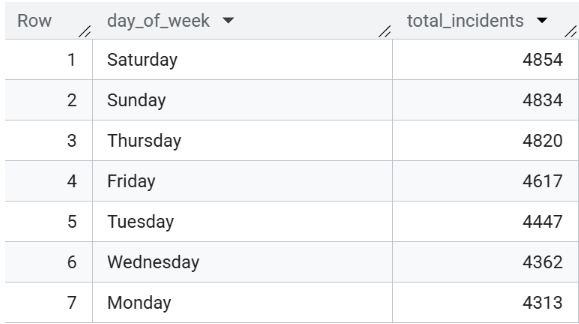
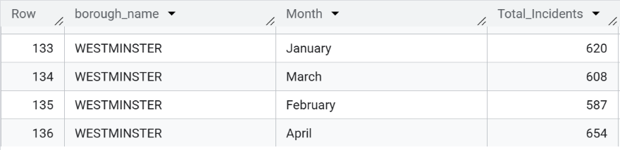

# 🔥 London Fire Brigade Incident Call Analysis (Jan–Apr 2017)

This project explores emergency incident call data from the **London Fire Brigade**, using a public dataset hosted on **Google BigQuery**.

## 🛠 Tools Used
- **SQL** (BigQuery)
- **Tableau Public** for visualisation

## 📁 Files Included
- `London_Fire_Brigade_Dashboard.twbx` – Tableau Packaged Workbook
- `query.sql` – SQL query used to extract and analyze the data 

## 📊 Key Insights
- Emergency call trends over time
- response patterns
- Outlier detection using ±3 standard deviations
- Station-level deployment metrics

## 🔗 Dashboard Link
[View on Tableau Public]
https://public.tableau.com/app/profile/emma.schenegg/viz/LondonFireBrigadeIncidentCallAnalysisJanApr2017/Incidentscallsbytypeandborough 


## 📌 About
This project is part of my data portfolio and demonstrates my ability to:
- Extract real-world data using SQL
- Perform statistical analysis
- Build interactive dashboards with Tableau

# SQL Analysis: London Fire Brigade Service Calls (BigQuery)

This project analyses the **London Fire Brigade Service Calls** dataset for 2017, focusing on data cleaning, incident volumes, and identifying unusual activity patterns.

Dataset: `bigquery-public-data.london_fire_brigade.fire_brigade_service_calls`

---

## 1. Data Cleaning

The dataset was first examined for consistency, completeness, and accuracy before any analytical processing. This step ensures that subsequent analysis is based on reliable data.

### 1.1 Checking Column Data Types

The table schema was reviewed to confirm that all columns use the correct and consistent data types.

```sql
SELECT
  column_name,
  data_type
FROM
  `bigquery-public-data.london_fire_brigade.INFORMATION_SCHEMA.COLUMNS`;
```


✅ All columns were found to have appropriate data formats, requiring no type conversions. 

### 1.2 Checking for Null Values Using Dynamic SQL

Null value counts were generated for all 34 fields using dynamic SQL, avoiding the need to manually write multiple COUNTIF statements.

```sql
DECLARE sql_query STRING;

SET sql_query = (
  SELECT STRING_AGG(
    FORMAT("COUNTIF(%s IS NULL) AS %s_nulls", column_name, column_name)
  )
  FROM `bigquery-public-data.london_fire_brigade.INFORMATION_SCHEMA.COLUMNS`
  WHERE table_name = 'fire_brigade_service_calls'
);

EXECUTE IMMEDIATE FORMAT("""
SELECT
  COUNT(*) AS total_rows,
  %s
FROM `bigquery-public-data.london_fire_brigade.fire_brigade_service_calls`
""", sql_query)
```


Key Findings:

special_service_type: 22,166 nulls
easting_m, northing_m, postcode_full: 15,411 nulls
first_pump_arriving_* fields: 1,819 nulls
second_pump_arriving_* fields: 20,281 nulls
No null values in key temporal and geographic identifiers ✅

These results highlight specific attributes that may require filtering or imputation during analysis.

### 1.3 Checking for Duplicate Records

The uniqueness of incident_number was validated to ensure each record represents a distinct incident.

```sql
SELECT
  incident_number,
  COUNT(*) AS count
FROM
  `bigquery-public-data.london_fire_brigade.fire_brigade_service_calls`
GROUP BY
  incident_number
HAVING
  COUNT(*) > 1
```


✅ No duplicate records were identified; incident_number is a unique identifier. 

### 1.4 Validating Numeric Columns

Numeric fields were checked for logically invalid entries, such as negative times or counts.

```sql
SELECT 
  COUNTIF(first_pump_arriving_attendance_time < 0) AS invalid_first_pump_time,
  COUNTIF(second_pump_arriving_attendance_time < 0) AS invalid_second_pump_time,
  COUNTIF(num_stations_with_pumps_attending < 0) AS invalid_station_count,
  COUNTIF(num_pumps_attending < 0) AS invalid_pump_count
FROM `bigquery-public-data.london_fire_brigade.fire_brigade_service_calls`
```


✅ No negative or otherwise invalid numeric values were detected.

### 1.5 Check the time span covered by the dataset.

The earliest and latest dates of incidents were identified to establish the temporal coverage of the dataset.

```sql
SELECT
  MIN(DATE(date_of_call)) AS start_date,
  MAX(DATE(date_of_call)) AS end_date
FROM
    `bigquery-public-data.london_fire_brigade.fire_brigade_service_calls`
```


The dataset spans from 01/01/2017 to 30/04/2017, covering a four-month period.

## 2. Incident Volume and Frequency 

Incident call records were aggregated and grouped to identify trends in volume and distribution across different timeframes and categories.

### 2.1 Total Incidents by Type

"Incidents were grouped by incident_group to quantify the frequency of each category. The dataset included three incident groups: False Alarm, Fire, and Special Services. Special Services encompass non-fire emergencies such as rescues, hazardous material incidents, assistance to other agencies, and various public safety support activities."

```sql
SELECT
  incident_group,
  COUNT(*) AS group_category
FROM
  `bigquery-public-data.london_fire_brigade.fire_brigade_service_calls`
GROUP BY
  incident_group
ORDER BY
  group_category
```


The results indicate that False Alarms were the most frequent cause of incident calls (15,732), followed by Special Services (10,081), and Fire incidents (6,434).

### 2.2 Incidents per Month

Monthly trends were examined to identify seasonal patterns or surges in incident calls.

```sql
SELECT
  DATE_TRUNC(date_of_call, MONTH) AS month,
  incident_group,
  COUNT(*) AS total
FROM
  `bigquery-public-data.london_fire_brigade.fire_brigade_service_calls`
GROUP BY month, incident_group
ORDER BY month, total DESC
```


The results indicate that False Alarms were the primary cause of calls each month, with January recording the highest number (4,299) and February the lowest (3,681). For Fire incidents, April received the most calls (2,316), while February had the fewest (1,169). Regarding Special Services, January was the busiest month (2,609), whereas February and March were the lowest, with an equal number of calls (2,478 each).

### 2.3 Incidents by Weekday

The day-of-week distribution was analysed to detect workload patterns across the week.

```sql
SELECT
  FORMAT_DATE('%A', date_of_call) AS day_of_week,
  COUNT(*) AS total_incidents
FROM
  `bigquery-public-data.london_fire_brigade.fire_brigade_service_calls`
GROUP BY day_of_week
ORDER BY total_incidents DESC
```



The results show that weekends were the busiest for incident calls, with Sunday receiving 4,854 calls and Saturday 4,834 calls. In contrast, Monday and Wednesday had the lowest number of calls, with Monday at 4,313 and Wednesday at 4,362.

### 2.4 Busiest Times of Day

Hourly call volume was examined to determine peak operational periods.

```sql
SELECT
  hour_of_call,
  COUNT(*) AS incident_count
FROM
  `bigquery-public-data.london_fire_brigade.fire_brigade_service_calls`
GROUP BY
  hour_of_call
ORDER BY 
  incident_count DESC
```


Results indicate a peak activity time occuring at 18:00 (2,187 calls)
and a lowest activity time occuring at 00:00 (485 calls)

## 3. Outlier Detection

Statistical analysis was used to identify extreme deviations in incident volume by time of day and by date.

### 3.1 Unusually Busy Hours

The analysis had previously been tested with a standard deviation of 3 and 2 but did not yield any results. Therefore, a z-score threshold of 1.5 standard deviations above the mean was applied to hourly counts to detect anomalously busy hours and found a moderate outlier.

```sql
WITH hourly_count AS (
  SELECT
    EXTRACT(HOUR FROM time_of_call) AS hour_of_day,
    COUNT(*) AS total_incidents
  FROM
    `bigquery-public-data.london_fire_brigade.fire_brigade_service_calls`
  GROUP BY hour_of_day
),
stats AS (
  SELECT
    AVG(total_incidents) AS avg_incidents,
    STDDEV(total_incidents) AS std_dev
  FROM hourly_count
)
SELECT
  hour_of_day,
  total_incidents
FROM
  hourly_count, stats
WHERE
  total_incidents > avg_incidents + 1.5 * std_dev
ORDER BY total_incidents DESC
```


📌 18:00 was identified as a moderate outlier, exceeding the average by more than 1.5 standard deviations. However, the moderate nature of the deviation suggests it may result from normal variability rather than a systemic issue, warranting further observation rather than immediate corrective action. 

### 3.2 Unusually Busy Days

Daily call counts were compared against a threshold of 3 standard deviations above the mean to detect exceptional spikes in activity.

```sql
WITH daily_count AS (
  SELECT 
    DATE(date_of_call) AS call_date,
    COUNT(*) AS total_incidents
  FROM 
    `bigquery-public-data.london_fire_brigade.fire_brigade_service_calls`
  GROUP BY call_date
),
stats AS (
  SELECT
    AVG(total_incidents) AS avg_incidents,
    STDDEV(total_incidents) AS std_dev
  FROM daily_count
)
SELECT
  call_date,
  total_incidents
FROM
  daily_count, stats
WHERE
  total_incidents > avg_incidents + 3 * std_dev
ORDER BY total_incidents DESC
```


📌 Result highlighted that 23 of February 2017, recording 525 incidents, is a significant outlier. After further research, this spike in incident calls is attributed to [Storm Doris](https://www.bbc.co.uk/news/live/uk-39068972), an extreme weather event that impacted London on that day.

## Geographical Distribution

The dataset was analysed to understand spatial patterns in London’s fire brigade incidents, identifying boroughs with the highest and lowest call volumes, differences in incident types, and how these trends vary over time. 

### 4.1 Incidents by Boroughs

The query below calculates total incidents for each borough, highlighting areas with higher operational demand. 

``` sql
SELECT
      borough_name,COUNT(*) AS total_incidents
FROM
      `bigquery-public-data.london_fire_brigade.fire_brigade_service_calls`
GROUP BY
    borough_name
ORDER BY
    total_incidents DESC
```


Westminster recorded the highest volume (2,469), while the City of London had the lowest (367).


### 4.2 Incident types by borough

This query provides a borough-level breakdown of incident categories, revealing whether certain boroughs face more fire-related, false alarm, or special service calls.

``` sql
SELECT
  incident_group, 
  borough_name,
  COUNT(*) AS incidents
FROM
    `bigquery-public-data.london_fire_brigade.fire_brigade_service_calls`
GROUP BY
  incident_group,
  borough_name
ORDER BY 
  borough_name
```


Lambeth recorded the highest number of calls related to Special services (610), while Westminster recorded the highest amount of fire-related calls (338) as well as the highest number of false alarm calls (1,651).

### 4.3 Percentage of Incident type by borough

To gain a clearer understanding of the distribution of each incident call types by borough, the following analysis will display the percentage of each incident call types for each borough.

```sql
SELECT
  borough_name,
  incident_group,
  COUNT(*) AS incident_count,
  ROUND(COUNT(*)*100/SUM(COUNT(*)) OVER(PARTITION BY borough_name),2) AS percentage
FROM
  `bigquery-public-data.london_fire_brigade.fire_brigade_service_calls`
GROUP BY
  borough_name, incident_group
ORDER BY 
   percentage DESC
```


The results indicates that The City of London has the highest percentage of false alarm calls (79%), Lambeth has the highest percentage of Special service-related calls (44%), and Barking and Daghennam has the highest percentage of Fire-related calls (30%).

### 4.3 Incident calls volume by borough by months

To detect temporal trends within each borough, the following query aggregates monthly incident counts.

```sql
SELECT
      borough_name,
      FORMAT_DATE('%B', DATE_TRUNC(date_of_call, MONTH)) AS Month,
      COUNT(*) AS Total_Incidents
FROM
      `bigquery-public-data.london_fire_brigade.fire_brigade_service_calls`
GROUP BY
     borough_name, Month 
ORDER BY
      borough_name
```


## First Pump

This section evaluates the speed and consistency of first pump responses across boroughs and stations, as well as identifying extreme delays or unusually fast responses.

### 5.1 Average Response Time by Borough

```sql
SELECT
  borough_name,
  ROUND(AVG(first_pump_arriving_attendance_time),2) AS avg_first_pump_time
FROM
    `bigquery-public-data.london_fire_brigade.fire_brigade_service_calls`
WHERE
    first_pump_arriving_attendance_time IS NOT NULL
GROUP BY
    borough_name
ORDER BY
    avg_first_pump_time 
```


The quickest borough was Kensington and Chelsea (265s ≈ 4.4 min), while the slowest averaged 373s (≈ 6.2 min).


### 5.2 How many calls by borough resulted in help arriving 15min or more at location 

```sql
SELECT
borough_name,
COUNT(*) AS total_pump_15min
FROM
`bigquery-public-data.london_fire_brigade.fire_brigade_service_calls`
WHERE 
first_pump_arriving_attendance_time> 900
GROUP BY
borough_name
ORDER BY
 total_pump_15min DESC
```


### 5.3 Number of first pump sent by station

```sql
SELECT
      first_pump_arriving_deployed_from_station,
      COUNT(*) as number_first_pump_sent
FROM
      `bigquery-public-data.london_fire_brigade.fire_brigade_service_calls`
WHERE
      first_pump_arriving_deployed_from_station IS NOT NULL
GROUP BY
      first_pump_arriving_deployed_from_station
ORDER BY
      number_first_pump_sent DESC
```


### 5.4 How long in average do each station take to deploy first pump

```sql
SELECT
first_pump_arriving_deployed_from_station,
COUNT(*) AS number_pump_sent_from_station,
ROUND(AVG(first_pump_arriving_attendance_time),2) AS avg_attendance_time
FROM
`bigquery-public-data.london_fire_brigade.fire_brigade_service_calls`
WHERE
first_pump_arriving_deployed_from_station IS NOT NULL
AND first_pump_arriving_attendance_time IS NOT NULL
GROUP BY 
first_pump_arriving_deployed_from_station
ORDER BY
avg_attendance_time
```


Battersea had the quickest average response (), while Staines was the slowest() — although Staines had only one recorded intervention in the dataset.


### 5.5 Identifying Outliers in First Pump Response Times

Outliers were detected by calculating the mean and standard deviation of attendance times, and flagging values that lie beyond ±3σ, which typically covers 99.7% of normally distributed data.

```sql
WITH response_stats AS (
SELECT 
AVG(first_pump_arriving_attendance_time) AS avg_time,
STDDEV(first_pump_arriving_attendance_time) AS std_dev
FROM 
`bigquery-public-data.london_fire_brigade.fire_brigade_service_calls`
WHERE 
first_pump_arriving_attendance_time IS NOT NULL
)

SELECT 
date_of_call,
first_pump_arriving_deployed_from_station,
first_pump_arriving_attendance_time
FROM 
`bigquery-public-data.london_fire_brigade.fire_brigade_service_calls`, response_stats
WHERE 
first_pump_arriving_attendance_time > avg_time + 3 * std_dev
OR first_pump_arriving_attendance_time < avg_time - 3 * std_dev
ORDER BY 
first_pump_arriving_attendance_time DESC
```


## Second pump

### 6.1 Which stations most often respond as the second pump?

The following query identified the stations that most often deployed as the second pump:

```sql
SELECT 
second_pump_arriving_deployed_from_station AS station,
COUNT(*)AS number_of_times_responded
FROM 
`bigquery-public-data.london_fire_brigade.fire_brigade_service_calls`
WHERE 
second_pump_arriving_deployed_from_station IS NOT NULL
GROUP BY 
station
ORDER BY 
number_of_times_responded DESC
```


### 6.2 Which station send more help to other station for the second pump

The following analysis measured cross-station support, identifying the stations most frequently providing a second pump to assist incidents where the first pump originated elsewhere:

```sql
SELECT 
  second_pump_arriving_deployed_from_station AS helper_station,
  COUNT(*) AS times_helped_other_station
FROM
    `bigquery-public-data.london_fire_brigade.fire_brigade_service_calls`
WHERE
  second_pump_arriving_deployed_from_station IS NOT NULL
  AND first_pump_arriving_deployed_from_station IS NOT NULL
  AND second_pump_arriving_deployed_from_station != first_pump_arriving_deployed_from_station
GROUP BY
  helper_station
ORDER BY
  times_helped_other_station DESC
```


Stations providing the most assistance included Fulham (), Hammersmith(), and Chelsea().

### 6.3 Second pump arriving quicker than first pump on incident

The proportion of incidents where the second pump arrived before the first pump was calculated as follows:

```sql
SELECT
      second_pump_arriving_deployed_from_station,
      COUNT(*) AS total_second_pump_quicker_than_first_pump
FROM
    `bigquery-public-data.london_fire_brigade.fire_brigade_service_calls`
WHERE
      second_pump_arriving_attendance_time<first_pump_arriving_attendance_time
GROUP BY
      second_pump_arriving_deployed_from_station
ORDER BY
      total_second_pump_quicker_than_first_pump DESC
```


### 6.4 Count of second pump dispatched from same station as first pump

This query measured the frequency of both pumps being dispatched from the same station:

```sql
SELECT
      second_pump_arriving_deployed_from_station,
      COUNT(*) AS total_second_pump_same_as_first_pump
FROM
    `bigquery-public-data.london_fire_brigade.fire_brigade_service_calls`
WHERE
      second_pump_arriving_deployed_from_station=first_pump_arriving_deployed_from_station
GROUP BY
      second_pump_arriving_deployed_from_station
ORDER BY
      total_second_pump_same_as_first_pump DESC
```


## Incident Types and Property Insights

### 7.1 Incidents Types by property category

The dataset was queried to determine the frequency of incidents by property category. 

```sql
SELECT
  incident_group, COUNT(*) AS total_incidents
FROM
  `bigquery-public-data.london_fire_brigade.fire_brigade_service_calls`
GROUP BY
  incident_group
ORDER BY
  total_incidents DESC
```


The most common type of incident reported was false alarms, with a total of 15,732 calls. Special services incidents were the next most frequent, accounting for 10,081 calls. Fires were reported 6,434 times during the period analysed.

### 7.2  Incidents by property type

The data has been analysed to identify which property types experienced the highest number of incidents. 

```sql
SELECT
  property_type, COUNT(*) AS total_incidents
FROM
  `bigquery-public-data.london_fire_brigade.fire_brigade_service_calls`
GROUP BY
  property_type
ORDER BY
  total_incidents DESC
LIMIT 10
```
 

Flats or maisonettes with 4 to 9 storeys recorded the highest number of incidents, totaling 3,823, followed closely by single-occupancy houses with 3,784 incidents. This suggests that medium-sized residential buildings are particularly prone to emergency incidents.

### 7.3 Top property type involved in Incidents by borough

The data has been analysed to identify which property types were involved in the most incidents in each London borough, excluding records without geographic data.

```sql
SELECT
  property_type, 
  borough_name,
  COUNT(*) AS incidents
FROM
  `bigquery-public-data.london_fire_brigade.fire_brigade_service_calls`
WHERE
      borough_name != "NOT GEO-CODED"
GROUP BY
      borough_name, property_type
ORDER BY
      Incidents DESC 
```


## Holidays/ Weekdays/ Weekends

### 8.1 Are there spikes in incidents tied to seasons or holidays?

The data has been analysed to determine whether the number of incidents is higher during holidays compared to non-holidays.

```sql
CREATE TABLE calm-nation-467010-r3.london_data.daily_count AS (
SELECT
  DATE(date_of_call) AS Date,
  CASE
    WHEN DATE (date_of_call)IN 
  ('2017-01-01', '2017-01-02', '2017-04-14', '2017-04-17')  --New year/ Easter Monday/ Substitute bank holidays (because 1Jan was a Sunday)/Good Friday
    OR DATE(date_of_call) BETWEEN '2017-02-13'AND '2017-02-17' --Half-Term School Break
    OR DATE (date_of_call) BETWEEN '2017-04-03' AND '2017-04-17' --Easter School Holidays
  THEN 'Holidays'
  ELSE 'Non-Holidays'
 END AS day_type,
 incident_number,
 borough_name,
 COUNT (*) AS total_incidents
FROM
    `bigquery-public-data.london_fire_brigade.fire_brigade_service_calls`
GROUP BY
  date,day_type, incident_number, borough_name)

SELECT
  day_type,
  COUNT(*) AS number_of_days,
  SUM(total_incidents) AS total_incidents,
  AVG(total_incidents) AS avg_daily_incidents,
  ROUND(100* AVG(total_incidents)/ SUM(AVG(total_incidents)) OVER(), 2) AS pct_of_avg_daily_incidents
FROM
  daily_counts
GROUP BY
  day_type
ORDER BY
  day_type
```


Analysis shows that holidays account for 51.7% of total incidents, while non-holidays account for 48.3%. This indicates a slight increase in incident activity during holiday periods.

### 8.2 Average Daily incident calls compared to Overall Average Holidays vs Non-Holidays(in %)

The following analysis compares the average number of daily incidents on holidays and non-holidays to the overall daily average, expressed as a percentage.

```sql
-- AVG per day_type
WITH
avg_by_type AS(
  SELECT 
    day_type,
    AVG(total_incidents) AS avg_daily_incidents
  FROM calm-nation-467010-r3.london_data.daily_count
  GROUP BY day_type), 

-- Overall average

overall_average AS(
  SELECT
  AVG(total_incidents) AS avg_all_days
  FROM calm-nation-467010-r3.london_data.daily_count
)

-- Calculate percentage comparison

SELECT
  a.day_type,
  a.avg_daily_incidents,
  o.avg_all_days,
  ROUND(a.avg_daily_incidents/o.avg_all_days*100, 2) AS pct_of_overall
  FROM avg_by_type a
  CROSS JOIN overall_average o
```


### 8.3 Holidays vs Non-Holidays breakdown

The daily total number of incidents has been analysed to compare incidents on holidays versus non-holidays across the year.

```sql
SELECT
  day_type,
  date_of_call,
  COUNT (*) AS total_incidents
FROM
  calm-nation-467010-r3.london_data.daily_count AS dc
INNER JOIN 
  `bigquery-public-data.london_fire_brigade.fire_brigade_service_calls` AS f
ON 
    dc.date = f.date_of_call
GROUP BY
  date_of_call, day_type
ORDER BY
  date_of_call
```
 
 
### 8.4 Incident type by day type

The data has been analysed to determine how different types of incidents are distributed across weekdays, weekends, and holidays.

```sql
CREATE TABLE `calm-nation-467010-r3.london_data.day_type` AS
SELECT
  incident_group,
  DATE(date_of_call) AS date
  CASE
    WHEN DATE(date_of_call) IN ('2017-01-01', '2017-01-02','2017-04-14', '2017-04-17')
      OR DATE(date_of_call) BETWEEN '2017-02-13' AND '2017-02-17'
      OR DATE(date_of_call) BETWEEN '2017-04-03' AND '2017-04-17'
      THEN 'Holiday'
    WHEN EXTRACT(DAYOFWEEK FROM DATE(date_of_call)) IN (1,7)
      THEN 'Weekend'
    ELSE 'Weekday'
  END AS day_type
FROM
  `bigquery-public-data.london_fire_brigade.fire_brigade_service_calls`
)

  SELECT
    day_type,
    incident_group,
    COUNT(*) AS total_incidents
  FROM daily_count
  GROUP BY day_type, incident_group
  ORDER BY day_type, total_incidents DESC
```
 
 
### 8.5 Incident calls during weekday by borough

The following analysis identifies which boroughs experience the most incidents on weekdays.

```sql
SELECT
  borough_name, 
  day_type,
  COUNT(*) AS total_incidents_by_borough
FROM
  calm-nation-467010-r3.london_data.day_type
WHERE
  day_type = 'Weekday'
GROUP BY
  borough_name, day_type
ORDER BY
  total_incidents_by_borough DESC
```

 
### 8.6 Incident calls during weekends by borough

Next, the borough-level incident data has been examined to determine which areas experience the highest number of fire service calls during weekends.

```sql
SELECT
  borough_name, 
  day_type,
  COUNT(*) AS total_incidents_by_borough
FROM
  calm-nation-467010-r3.london_data.day_type
WHERE
  day_type = 'Weekend'
GROUP BY
  borough_name, day_type
ORDER BY
  total_incidents_by_borough DESC
```
 
 
### 8.7 Incident calls during holidays by borough

The borough-level incident data has been examined to determine which areas experience the highest number of fire service calls during holidays.

```sql
SELECT
  borough_name, 
  day_type,
  COUNT(*) AS total_incidents_by_borough
FROM
  calm-nation-467010-r3.london_data.day_type
WHERE
  day_type = 'Holiday'
GROUP BY
  borough_name, day_type
ORDER BY
  total_incidents_by_borough DESC
	```

